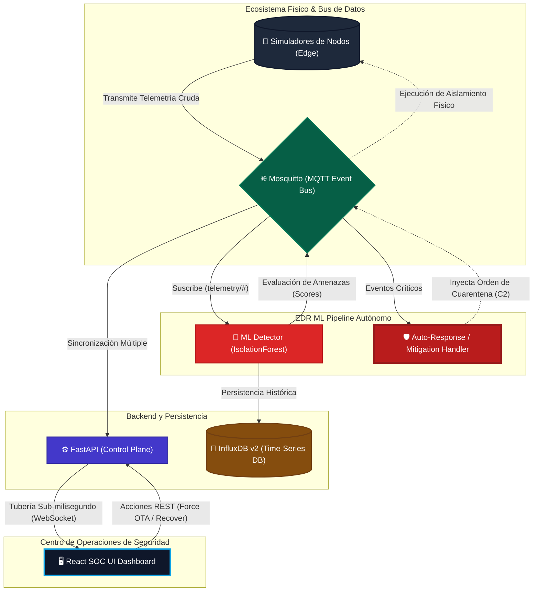

# IoT Edge EDR (Endpoint Detection & Response) 🛡️

Plataforma de seguridad IoT en el borde con capacidades de respuesta autónoma (Zero-Trust), inspirada en Darktrace y Armis. Diseñada para ejecutarse nativamente en arquitectura `linux/arm64` como la de Raspberry Pi 5.

## 🏗️ Arquitectura del Sistema



### Componentes Core
1. **IoT Simulator:** Emula un sensor IoT enviando telemetría de red. Genera tráfico anómalo (Exfiltración/DDoS) inyectable mediante comandos.
2. **Broker MQTT (Mosquitto):** Bus de eventos de baja latencia para mensajería entre microservicios locales en el borde.
3. **EDR ML Engine (Isolation Forest):** Escucha el tráfico, entrena un modelo base de normalidad y aísla desviaciones extremas. Evalúa el riesgo y genera Anomaly Scores en InfluxDB.
4. **Response Handler:** Analiza la persistencia de las anomalías (>5 payloads maliciosos consecutivos). Mitiga activamente enviando paquetes remotos de `quarantine` sobre MQTT a los dispositivos infectados para aislar el host físicamente.
5. **TSDB (InfluxDB v2):** Optimizado para retención de millones de datos temporales, asegurando la telemetría del SOC.
6. **Backend (FastAPI):** Expone APIs REST para orquestación y multiplexa la telemetría consumida por MQTT hacia WebSockets en vivo.
7. **Frontend (React + Tailwind):** Dashboard SOC cibernético estilo industrial, mostrando analíticas cruzadas e inyección de contingencias críticas.

## 🚀 Guía de Despliegue en Producción (Raspberry Pi 5)

La arquitectura de dependencias Python ha sido fortificada con `build-essential` para compilar binarios matemáticos en `linux/arm64`.

```bash
cd iot_edge_ids

# Levanta todo el stack local
docker-compose up -d --build
```

### Puntos de Acceso Externos
- **Frontend SOC Dashboard:** `http://localhost:3000`
- **Backend API / Docs:** `http://localhost:8001/docs`
- **InfluxDB UI:** `http://localhost:8086` (User: `admin` / Password: `adminpassword`)

## 📡 Endpoints API y Control de Tráfico C2

### WebSockets (Telemetría SOC en Vivo)
- `ws://localhost:8001/ws/telemetry`

### Protocolos REST Activos
- **Inyectar Ataque Zero-Day Distribuido**
  - **Endpoint:** `POST /api/attack`
  - **Body:** `{"sensor_id": "sensor_01"}`
- **Restaurar Tráfico (Override Cuarentena Defensiva)**
  - **Endpoint:** `POST /api/restore`
  - **Body:** `{"sensor_id": "sensor_01"}`
