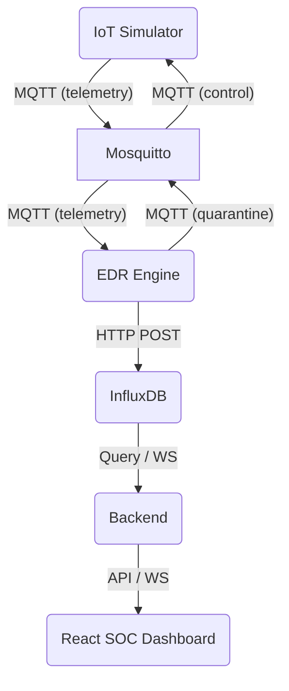

# Edge EDR (Endpoint Detection & Response) for IoT

Este proyecto implementa un EDR perimetral (Edge EDR) enfocado en dispositivos IoT, empleando capacidades de detección de anomalías (Zero-Day) mediante un modelo de Machine Learning (`IsolationForest`), con la habilidad de realizar respuesta autónoma aislando dispositivos comprometidos de la red.

## Arquitectura del Sistema

El sistema está diseñado para ser desplegado en entornos con arquitectura `arm64` (como Raspberry Pi 5) y se divide en 5 contenedores principales, orquestados por Docker Compose conectados a través de una red interna dedicada (`soc_network`):

1. **Mosquitto (MQTT Broker):** El bus de eventos y mensajería del sistema.
2. **InfluxDB v2 (TSDB):** Base de datos de series temporales que almacena la telemetría enviada por los dispositivos y los _Anomaly Scores_ producidos por el EDR.
3. **IoT Simulator:** Dispositivo simulado que genera tráfico de red (matemáticamente modelado) hacia el broker MQTT.
4. **EDR Engine:** Motor perimetral de Machine Learning que evalúa anomalías y emite órdenes de cuarentena.
5. **Backend (API + WebSocket):** Creado en FastAPI, ofrece endpoints REST para la interacción del usuario y WebSockets para actualización de datos en tiempo real al dashboard Frontend.



## Flujo de Telemetría y Contención

1. El simulador IoT genera y envía métricas de red a intervalos regulares hacia `telemetry/sensor_01`.
2. El EDR recibe las métricas y calcula un score de anomalía utilizando `IsolationForest`.
3. Ambos, la telemetría cruda y el _anomaly score_, persisten en InfluxDB.
4. Si los puntajes de anomalía superan el límite consistentemente (reduciendo falsos positivos), el EDR emite un comando de acción de `quarantine` hacia The IoT Simulator a través del tópico `control/sensor_01`.
5. El dispositivo afectado, al recibir el comando, se aísla deteniendo sus emisiones normales.

## Instrucciones de Despliegue Local

1. Clona este repositorio y navega hasta el directorio del proyecto.
2. Asegúrate de tener Docker y Docker Compose instalados.
3. El proyecto está pre-configurado para construirse y correr en arquitecturas `linux/arm64`.

Ejecuta el siguiente comando para levantar el entorno completo:

```bash
docker-compose up -d --build
```

(*Nota: La estructura será completada y ampliada en las fases siguientes del desarrollo.*)
