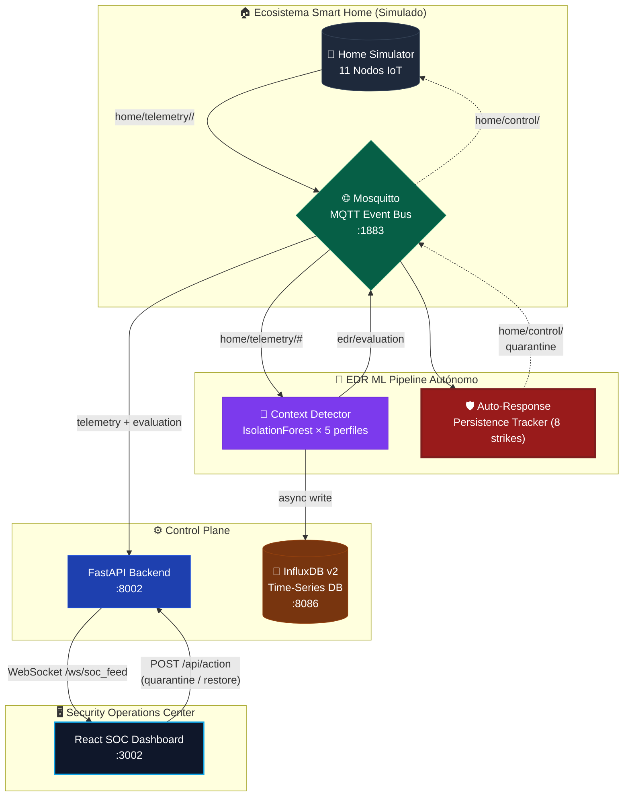

# 🏠🛡️ Smart Home EDR — Edge Detection & Response Platform

> **Plataforma de Seguridad EDR contextualizada para el hogar inteligente.**  
> Detecta amenazas Zero-Day usando Machine Learning (Isolation Forest), aísla dispositivos comprometidos de forma autónoma y ofrece un panel SOC en tiempo real.

---

## 📐 Arquitectura del Sistema



---

## 🚀 Inicio Rápido

### Pre-requisitos
- Docker Desktop ≥ 24
- Docker Compose v2
- Python 3.10+ (solo para `attack_scripts`)

### Despliegue

```bash
git clone https://github.com/PocketNugget/IOT-EDR.git
cd IOT-EDR/smart_home_edr

docker-compose up -d --build
```

### URLs de Acceso

| Servicio | URL | Descripción |
|---|---|---|
| **SOC Dashboard** | http://localhost:3002 | Panel de seguridad en tiempo real |
| **Backend API** | http://localhost:8002/docs | Swagger UI / REST API |
| **InfluxDB UI** | http://localhost:8086 | Time-Series Database |
| **MQTT Broker** | localhost:1883 | Bus de eventos IoT |

**Credenciales InfluxDB:** `admin` / `adminpassword`

---

## 📦 Estructura del Proyecto

```
smart_home_edr/
├── docker-compose.yml          # Orquestación de todos los servicios
├── README.md                   # Esta documentación
│
├── simulator/                  # 🤖 Simulador de nodos IoT
│   ├── home_env.py             # Motor principal del simulador (11 dispositivos)
│   ├── requirements.txt
│   └── Dockerfile
│
├── edr/                        # 🧠 Motor ML de detección
│   ├── context_detector.py     # IsolationForest × 5 perfiles
│   ├── requirements.txt
│   └── Dockerfile
│
├── backend/                    # ⚙️ API FastAPI + WebSocket
│   ├── main.py                 # Control Plane, inventario, logs, WS
│   ├── requirements.txt
│   └── Dockerfile
│
├── frontend/                   # 🖥️ SOC Dashboard React
│   ├── src/
│   │   ├── App.jsx             # Componente principal del dashboard
│   │   ├── main.jsx
│   │   └── index.css
│   ├── package.json
│   ├── vite.config.js
│   ├── tailwind.config.js
│   └── Dockerfile
│
├── mosquitto/                  # 🌐 Broker MQTT
│   └── config/mosquitto.conf
│
└── attack_scripts/             # 🏴‍☠️ Simuladores Red Team (externos)
    ├── .venv/                  # Entorno virtual Python (gitignored)
    ├── 00_restore_device.py    # Herramienta de restauración
    ├── 01_mirai_botnet_scan.py # Ataque Mirai → Switch
    ├── 02_ransomware_lateral.py # Ransomware → Hub
    ├── 03_ddos_flood.py        # DDoS Flood → Bulb
    ├── 04_vacuum_camera_hijack.py # Camera Hijack → Roomba
    └── requirements.txt
```

---

## 🤖 Simulador de Hogar (`simulator/home_env.py`)

El simulador crea **11 nodos IoT autónomos** que operan concurrentemente con `asyncio`. Cada dispositivo implementa un **estado físico real** con transiciones estadísticas.

### Dispositivos Simulados

| ID del Dispositivo | Tipo | Estados Posibles | Comportamiento Principal |
|---|---|---|---|
| `bulb_living_room` | `bulb` | ON ↔ OFF | Heartbeats mdns/hub pings |
| `bulb_kitchen` | `bulb` | ON ↔ OFF | ~7% probabilidad de toggle/tick |
| `bulb_bedroom1` | `bulb` | ON ↔ OFF | Standby: ~0 bytes |
| `bulb_bedroom2` | `bulb` | ON ↔ OFF | ON: 50 bytes avg |
| `bulb_bathroom` | `bulb` | ON ↔ OFF | |
| `bulb_porch` | `bulb` | ON ↔ OFF | |
| `switch_main_door` | `switch` | ON ↔ OFF | Bursts en evento toggle |
| `switch_garage` | `switch` | ON ↔ OFF | Puerto 8080 |
| `hub_central` | `hub` | ON (siempre) | ~2 KB/tick constante, puerto 8443 |
| `roomba_main` | `roomba` | CHARGING ↔ CLEANING | CLEANING: LiDAR ~8-12 KB/tick |
| `sprinkler_garden` | `sprinkler` | IDLE ↔ WATERING | WATERING: bursts HTTPS a weather API |

### Estados y Telemetría por Perfil

```
NORMAL:     bytes_in/out bajos, ports fijos, packet_rate predecible
UPDATING:   bytes_in muy alto (>10 KB), port 443, packet_rate elevado
ATTACKING:  bytes_out masivo, port ALEATORIO (1-65535), packet_rate extremo
QUARANTINED: 0 bytes, 0 pkt/s — dispositivo aislado de la red
```

### MQTT Topics (Producidos por el Simulador)

| Topic | Payload | Descripción |
|---|---|---|
| `home/telemetry/<type>/<id>` | JSON | Telemetría en tiempo real de cada nodo |
| `home/control/<id>` | `{"action": "..."}` | Comandos de control recibidos |

### Arquitectura de Clases

```python
SmartDevice (base)          # handle_command(), publish_telemetry(), restore_status
├── SmartBulb               # restore_status = "ON"
├── SmartSwitch             # restore_status = "OFF"
├── SmartHub                # restore_status = "ON" (siempre-encendido)
├── RobotVacuum             # restore_status = "CHARGING"
└── SprinklerSystem         # restore_status = "IDLE"
```

---

## 🧠 Motor EDR ML (`edr/context_detector.py`)

El corazón de la plataforma. Implementa detección de anomalías contextual — un modelo independiente por tipo de dispositivo.

### Modelo: Isolation Forest

| Parámetro | Valor | Razón |
|---|---|---|
| `contamination` | `0.005` (0.5%) | Minimiza falsos positivos en tráfico normal |
| `n_estimators` | `150` | Mayor estabilidad del árbol de aislamiento |
| `random_state` | `42` | Reproducibilidad |

### Perfiles de Entrenamiento (Distribuciones por Estado)

| Perfil | Estado Normal | % Muestras |
|---|---|---|
| `bulb` | OFF: 0-5 bytes + ON: ~50 bytes avg (port 80) | 700 OFF + 600 ON + 100 OTA |
| `switch` | OFF: 0-5 bytes + ON: ~60-80 bytes (port 8080) | 600 OFF + 500 ON + 100 OTA |
| `hub` | ON: ~2000/3500 bytes (port 8443) | 1100 normal + 100 OTA |
| `roomba` | CHARGING: ~0 bytes + CLEANING: ~8-12 KB (port 443) | 750 CHARGING + 350 CLEANING |
| `sprinkler` | IDLE: ~0 bytes + WATERING: ~3 KB (port 443) | 950 IDLE + 250 WATERING |

### Lógica de Cuarentena Autónoma

```
Para cada mensaje de telemetría recibido:
  1. Extraer features: [bytes_in, bytes_out, port, packet_rate]
  2. Predecir con IsolationForest del perfil correspondiente
  3. Si is_anomaly = 1:
       anomaly_tracker[device_id] += 1
       clean_streak = 0
       Si strikes >= 8: enforce_quarantine(device_id)
  4. Si is_anomaly = 0:
       clean_streak += 1
       Si clean_streak >= 3: anomaly_tracker -= 1
```

> **Nota:** La escritura a InfluxDB es completamente asíncrona (daemon thread) para nunca bloquear el loop MQTT.

### Features de Detección

```python
features = [[bytes_in, bytes_out, port, packet_rate]]
```

- **`bytes_in`** — Tráfico entrante en bytes
- **`bytes_out`** — Tráfico saliente en bytes  
- **`port`** — Puerto de destino (sensor clave: random ports = anomalía)
- **`packet_rate`** — Paquetes por segundo

---

## ⚙️ Backend API (`backend/main.py`)

FastAPI asíncrono que actúa como **Control Plane** del ecosistema.

### Endpoints REST

#### `GET /api/inventory`
Retorna el estado actual completo de todos los nodos registrados.

```json
{
  "roomba_main": {
    "device_type": "roomba",
    "status": "CHARGING",
    "metrics": { "bytes_in": 3, "bytes_out": 2, "port": 443, "packet_rate": 0, ... },
    "anomaly_score": 0.021,
    "is_anomaly": 0
  }
}
```

#### `GET /api/logs`
Retorna los últimos 500 eventos del sistema (estado, anomalías, aislamiento).

```json
[
  {
    "id": 1711234567890,
    "timestamp": 1711234567.89,
    "device_id": "roomba_main",
    "message": "⚠️ ACTIVE ISOLATION PROTOCOL EFFECTIVE.",
    "level": "success"
  }
]
```

#### `POST /api/action`
Despacha comandos defensivos SOC a dispositivos.

```json
// Request
{ "device_id": "roomba_main", "action": "quarantine" }
{ "device_id": "roomba_main", "action": "restore" }

// Response
{ "status": "success", "message": "[SOC] Action 'quarantine' dispatched to roomba_main" }
```

> ⚠️ El action `attack` está **intencionalmente bloqueado** en el backend. Solo los `attack_scripts/` externos pueden inyectar ataques directamente al bus MQTT.

#### `WebSocket /ws/soc_feed`
Stream en tiempo real a 1 Hz con el estado completo del ecosistema.

```json
{
  "inventory": { ... },
  "logs": [ ... últimos 40 eventos ]
}
```

### Topics MQTT Suscritos (Backend)

| Topic | Uso |
|---|---|
| `home/telemetry/#` | Registra nodos, rastrea cambios de estado |
| `edr/evaluation` | Inyecta anomaly scores en el inventario |

### Topics MQTT Publicados (Backend)

| Topic | Cuándo |
|---|---|
| `home/control/<device_id>` | Al recibir `POST /api/action` |

---

## 🖥️ SOC Dashboard (`frontend/src/App.jsx`)

Panel de seguridad construido en **React + Vite + Tailwind CSS**.

### Componentes Visuales

#### Device Grid
- Muestra los 11 nodos en tarjetas individuales
- Íconos por tipo de dispositivo (💡 Bulb, ⊡ Switch, 🖥️ Hub, 💨 Roomba, 💧 Sprinkler)
- Estado con colores semánticos:

| Estado | Color | Comportamiento |
|---|---|---|
| `ON` / `ONLINE` | 🟢 Verde | Normal |
| `OFF` | ⚫ Gris | Standby |
| `CHARGING` | 🔵 Azul claro | Roomba en dock |
| `CLEANING` | 🔵 Azul pulsante | Roomba limpiando |
| `WATERING` | 🟢 Teal pulsante | Riego activo |
| `UPDATING` | 🔵 Azul pulsante | OTA en progreso |
| `ATTACKING` | 🟠 Naranja | Tráfico malicioso detectado |
| `QUARANTINED` | 🔴 Rojo + outline | Aislamiento activo |

#### Threat Score Bar
Barra visual por dispositivo del score del IsolationForest (0-100%).

- Verde: < 30%
- Naranja: 30-60%
- Rojo: > 60%

#### SOC Actions (por dispositivo)
- **ISOLATE** — Cuarentena manual del analista (siempre disponible si no está aislado)
- **RESTORE** — Reconecta el nodo a la red (solo visible cuando está QUARANTINED)

#### Ecosystem Threat Trajectory Chart
- Línea temporal del score medio de anomalías del ecosistema completo
- Líneas de referencia: `WARN` (30%) y `CRIT` (60%)
- Ventana deslizante de los últimos 40 puntos

#### SIEM Audit Terminal
- Columna derecha con feed de eventos en tiempo real
- Código de color por severidad:
  - 🔴 `error` — Anomalía detectada
  - 🟢 `success` — Cuarentena efectiva / Restauración
  - 🟠 `warning` — Tráfico sospechoso
  - ⚪ `info` — Registro de nodo

### WebSocket Auto-Reconexión
El cliente WebSocket incluye lógica de reconexión automática con delay de 3 segundos ante caídas del backend.

### Stack Tecnológico Frontend

| Librería | Versión | Uso |
|---|---|---|
| React | 18 | UI Framework |
| Vite | 5 | Build tool + Dev server |
| Tailwind CSS | 3 | Utility-first styling |
| Recharts | latest | Gráficos de telemetría |
| Lucide React | latest | Íconos |

---

## 🏴‍☠️ Scripts de Ataque Red Team (`attack_scripts/`)

Simuladores de vectores de ataque externos que inyectan directamente al bus MQTT físico (bypasando el EDR REST API).

### Setup del Entorno

```bash
cd smart_home_edr/attack_scripts
source .venv/bin/activate        # Activar entorno Python
# (El .venv ya está creado con paho-mqtt instalado)
```

### Scripts Disponibles

#### `00_restore_device.py` — Restauración SOC CLI

```bash
python 00_restore_device.py                   # Menú interactivo
python 00_restore_device.py roomba_main       # Dispositivo específico
python 00_restore_device.py all               # Restaurar todos los nodos
```

#### `01_mirai_botnet_scan.py` — Infección Mirai
- **Objetivo:** `switch_main_door`
- **Simula:** Escaneo de puertos HTTP/Telnet (Botnet Mirai)
- **Anomalía generada:** bytes_out masivo + port aleatorio

```bash
python 01_mirai_botnet_scan.py
```

#### `02_ransomware_lateral.py` — Movimiento Lateral
- **Objetivo:** `hub_central`
- **Simula:** Ransomware propagándose vía el orquestador LAN
- **Anomalía generada:** Tráfico voluminoso transversal + puertos no reconocidos

```bash
python 02_ransomware_lateral.py
```

#### `03_ddos_flood.py` — DDoS Flood Outbound
- **Objetivo:** `bulb_living_room`
- **Simula:** Foco comprometido como nodo zombie para DDoS
- **Anomalía generada:** packet_rate extremo (~500/s) vs baseline 2/s

```bash
python 03_ddos_flood.py
```

#### `04_vacuum_camera_hijack.py` — Exfiltración de Cámara
- **Objetivo:** `roomba_main`
- **Simula:** Hijack de la cámara de la Roomba, streaming constante de video
- **Anomalía generada:** bytes_out masivo (~120 KB/tick) vs baseline CLEANING ~12 KB

```bash
python 04_vacuum_camera_hijack.py
```

### Flujo de un Ataque Completo

```
1. Script inyecta {"action": "attack"} → home/control/<device_id>
2. Simulador recibe → status = "ATTACKING", genera tráfico anómalo
3. EDR Engine recibe telemetría → IsolationForest predice anomalía
4. Anomaly Tracker: Strike 1/8 → 2/8 → ... → 8/8
5. EDR publica → home/control/<device_id> con {"action": "quarantine"}
6. Simulador → status = "QUARANTINED", publica 0 bytes
7. Backend → actualiza inventario → WebSocket → Frontend
8. Dashboard → tarjeta pasa a ROJO con botón RESTORE
```

---

## 🗄️ Infraestructura (`docker-compose.yml`)

### Servicios y Puertos

| Container | Imagen / Build | Puerto Host | Red Interna |
|---|---|---|---|
| `smarthome_mosquitto` | `eclipse-mosquitto:2.0` | `1883` | `mosquitto:1883` |
| `smarthome_influxdb` | `influxdb:2.7` | `8086` | `influxdb:8086` |
| `smarthome_simulator` | `./simulator` | — | interno |
| `smarthome_ml_engine` | `./edr` | — | interno |
| `smarthome_backend` | `./backend` | `8002` → `8000` | `backend:8000` |
| `smarthome_dashboard` | `./frontend` | `3002` → `3000` | `frontend:3000` |

### Red Docker
Todos los servicios comparten la red bridge `home_network` para comunicación inter-servicio segura.

### Variables de Entorno InfluxDB

| Variable | Valor |
|---|---|
| `DOCKER_INFLUXDB_INIT_ORG` | `soc_org` |
| `DOCKER_INFLUXDB_INIT_BUCKET` | `telemetry` |
| `DOCKER_INFLUXDB_INIT_ADMIN_TOKEN` | `super_secret_token_123` |
| `DOCKER_INFLUXDB_INIT_USERNAME` | `admin` |
| `DOCKER_INFLUXDB_INIT_PASSWORD` | `adminpassword` |

---

## 📊 Métricas de InfluxDB

El EDR Engine escribe en el bucket `telemetry` con el measurement `home_telemetry`.

### Schema de Datos

| Field | Tipo | Descripción |
|---|---|---|
| `bytes_in` | float | Tráfico entrante (bytes) |
| `bytes_out` | float | Tráfico saliente (bytes) |
| `port` | float | Puerto de red utilizado |
| `packet_rate` | float | Paquetes por segundo |
| `anomaly_score` | float | Score ML normalizado (>0 = más anómalo) |
| `is_anomaly` | int | 1 = anomalía detectada, 0 = normal |

**Tags:** `device_id`, `device_type`

---

## 🔄 Comandos de Gestión

```bash
# Levantar el stack completo
cd smart_home_edr && docker-compose up -d --build

# Ver logs en tiempo real de cada servicio
docker logs smarthome_ml_engine -f        # EDR Engine (strikes, quarantine)
docker logs smarthome_simulator -f        # Simulador (11 dispositivos)
docker logs smarthome_backend -f          # API Backend
docker logs smarthome_dashboard -f        # Frontend Vite

# Reiniciar un servicio específico
docker-compose restart backend
docker-compose restart edr_engine

# Parar todo
docker-compose down

# Reset completo (incluyendo volúmenes de InfluxDB)
docker-compose down -v
```

---

## 🎯 Casos de Uso y Testing

### Escenario 1: Monitoreo Pasivo Normal
1. Iniciar el stack: `docker-compose up -d`
2. Abrir [http://localhost:3002](http://localhost:3002)
3. Observar los 11 nodos fluctuando naturalmente (ON/OFF, CHARGING/CLEANING, IDLE/WATERING)
4. El dashboard no debería generar cuarentenas automáticas

### Escenario 2: Respuesta Autónoma a Botnet
1. Con el stack corriendo, activar el venv: `cd attack_scripts && source .venv/bin/activate`
2. Ejecutar: `python 01_mirai_botnet_scan.py`
3. Observar en el Dashboard: `switch_main_door` pasa a ATTACKING → acumulación de strikes → QUARANTINED
4. La cuarentena se dispara tras 8 strikes consecutivos del IsolationForest

### Escenario 3: Restauración Manual SOC
1. Con un dispositivo QUARANTINED, hacer clic en **RESTORE** en el Dashboard
2. Alternativa CLI: `python 00_restore_device.py switch_main_door`
3. El dispositivo retorna a su estado idle (OFF/ON/CHARGING según tipo)

### Escenario 4: Cuarentena Manual Preventiva
1. Hacer clic en **ISOLATE** en cualquier tarjeta del Dashboard
2. Envía `POST /api/action {"device_id": "...", "action": "quarantine"}` al backend
3. El backend publica al MQTT → el simulador aísla el dispositivo

---

## 🏗️ Plataforma Objetivo: Raspberry Pi 5

El proyecto está optimizado para `linux/arm64`:

- Los `Dockerfiles` incluyen `build-essential`, `gcc`, `gfortran`, `libopenblas-dev` para compilar dependencias científicas (`scikit-learn`, `numpy`) en ARM64.
- Compatible con Apple Silicon (macOS) para desarrollo local.

```bash
# En Raspberry Pi 5
git clone https://github.com/PocketNugget/IOT-EDR.git
cd IOT-EDR/smart_home_edr
docker-compose up -d --build   # Compila nativo arm64
```

---

## 🔐 Consideraciones de Seguridad

| Área | Estado Actual | Mejora Recomendada |
|---|---|---|
| MQTT Auth | Sin autenticación | Agregar usuario/contraseña en `mosquitto.conf` |
| MQTT TLS | Sin TLS | Habilitar TLS en puerto 8883 |
| API Auth | Sin autenticación | JWT Bearer tokens |
| InfluxDB Token | Token hardcoded | Usar Docker Secrets o vars de entorno |
| CORS | `allow_origins=["*"]` | Restringir a origen específico en prod |

---

## 📦 Dependencias por Servicio

### Simulator
```
numpy==1.26.4
paho-mqtt==1.6.1
```

### EDR Engine
```
scikit-learn==1.3.2
numpy==1.26.4
paho-mqtt==1.6.1
influxdb-client==1.36.1
```

### Backend
```
fastapi==0.109.0
uvicorn==0.27.0
pydantic==2.5.3
paho-mqtt==1.6.1
websockets==12.0
```

### Attack Scripts (entorno local)
```
paho-mqtt==1.6.1
```
